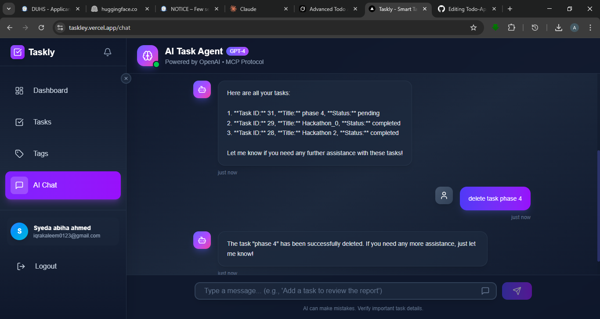
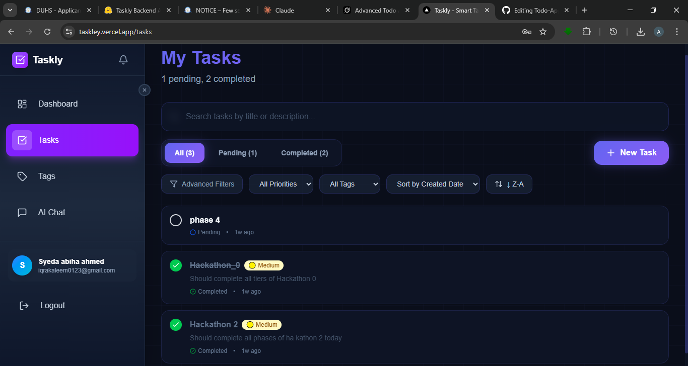
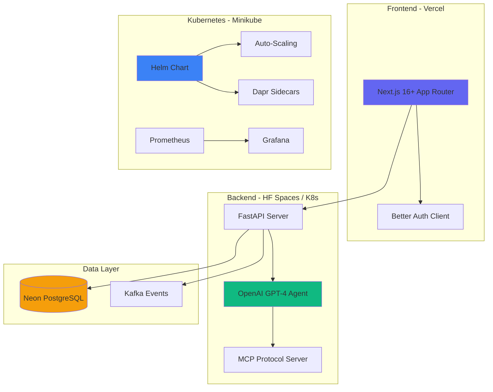
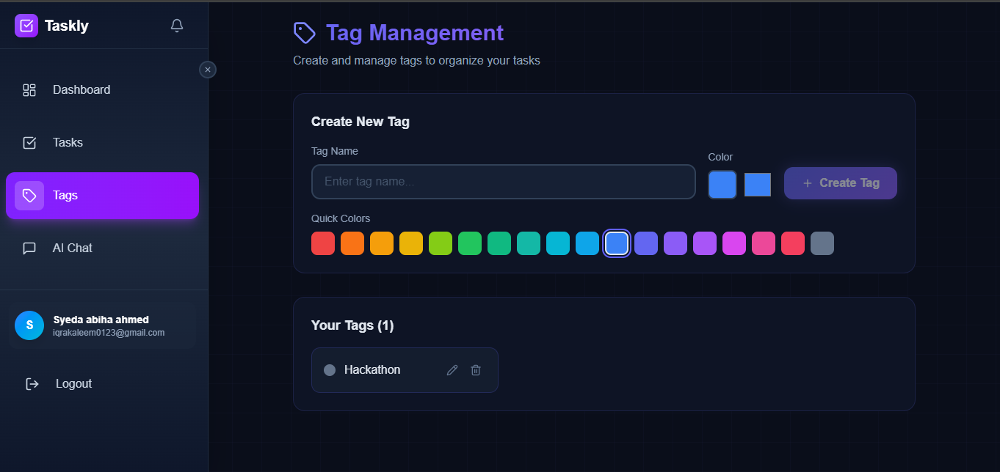

<div align="center">

# ✅ Taskly

### AI-Native Task Management for the Modern Developer

[](https://taskley.vercel.app/)
[](https://github.com/ABIHAAHEMD4262/Todo-App)
[]()

**From console app → Full-stack web app → AI chatbot → Kubernetes-ready in 5 phases**

Built with Next.js 16+ • FastAPI • PostgreSQL • OpenAI GPT-4 • Kubernetes • Helm • Dapr

[Live Demo](https://taskley.vercel.app/) · [Watch Demo Video](#demo-video) · [View Architecture](#architecture-overview)

</div>

---

## 🎬 Live Demo

**Experience Taskly now:** [https://taskley.vercel.app/](https://taskley.vercel.app/)

| Feature | What You'll See |
|---------|-----------------|
| **AI Chat** | Natural language task management with GPT-4 |
| **Smart Dashboard** | Real-time stats, completion rates, activity feed |
| **Advanced Tasks** | Priorities, tags, due dates, recurring schedules |
| **Beautiful UI** | Modern dark theme with glassmorphism effects |

> 💡 **Try saying:** "Add a task to review the project proposal tomorrow with high priority"

---

## 🚀 Phase V – Advanced Cloud Deployment

**Status:** ✅ Complete (Local Kubernetes + Production Readiness)

Phase V transforms Taskly into a **cloud-native, event-driven application** ready for enterprise deployment.

### What's Deployed

| Component | Status | Environment |
|-----------|--------|-------------|
| **Frontend** | ✅ Live | [Vercel](https://taskley.vercel.app/) |
| **Backend API** | ✅ Live | [Hugging Face Spaces](https://huggingface.co/spaces/AbihaCodes/Taskly_Chatbot) |
| **Database** | ✅ Live | Neon Serverless PostgreSQL |
| **Kubernetes** | ✅ Validated | Local Minikube Cluster |

### Cloud-Native Architecture (Validated on Minikube)

```
✅ Helm Chart deployment with parameterized values
✅ Horizontal Pod Autoscaler (HPA) configured
✅ Dapr sidecar integration for pub/sub
✅ Kafka event streaming (task.completed, reminder.due)
✅ Prometheus + Grafana monitoring stack
✅ GitHub Actions CI/CD pipeline
```

### Why Local Kubernetes?

I chose to **validate thoroughly on Minikube** rather than deploy to a cloud cluster because:

1. **Cost-conscious development** – Free tier limits on cloud Kubernetes
2. **Full validation** – Every manifest, Helm chart, and Dapr binding tested
3. **Production-ready artifacts** – One `helm install` away from any cloud (AKS, EKS, GKE)

```bash
# Deploy to any Kubernetes cluster
helm install taskly ./helm-chart -n taskly --create-namespace
```

---

## ✨ Key Features Demo

### 🤖 AI-Powered Task Management
- **Natural language input** – "Add a meeting with the team next Monday at 3pm"
- **GPT-4 agent** with MCP (Model Context Protocol) integration
- **Smart actions** – Create, update, complete, delete tasks via chat
- **Context-aware responses** – Understands priorities, tags, due dates


*Creating tasks with natural language – GPT-4 understands context, priorities, and dates*

### 📊 Intelligent Dashboard
- Real-time task statistics (total, pending, completed)
- Completion rate tracking with progress visualization
- Recent activity feed with action history
- Quick action buttons for common operations


*Real-time statistics and activity tracking*

### 📋 Advanced Task Features
- **Priorities** – Urgent, High, Medium, Low with color coding
- **Tags** – Custom categories with color picker
- **Due dates** – Date picker with overdue highlighting
- **Recurring tasks** – Daily, weekly, monthly schedules
- **Search & filters** – Find any task instantly
- **Sort options** – By date, priority, title, status


*Advanced filtering, sorting, and tag management*

### 🔐 Secure Authentication
- JWT-based authentication with Better Auth
- Protected routes and API endpoints
- Secure session management

---

## 🏗️ Architecture Overview



### System Architecture Diagram

```
┌─────────────────────────────────────────────────────────────────────────┐
│                              FRONTEND                                    │
│                         (Vercel Deployment)                              │
│  ┌─────────────────────────────────────────────────────────────────┐   │
│  │  Next.js 16+ App Router │ TypeScript │ Tailwind CSS │ Better Auth│   │
│  └─────────────────────────────────────────────────────────────────┘   │
└─────────────────────────────────┬───────────────────────────────────────┘
                                  │ HTTPS/REST
                                  ▼
┌─────────────────────────────────────────────────────────────────────────┐
│                              BACKEND                                     │
│                    (HF Spaces / Kubernetes)                              │
│  ┌───────────────┐  ┌───────────────┐  ┌───────────────────────────┐   │
│  │   FastAPI     │  │  GPT-4 Agent  │  │    MCP Protocol Server    │   │
│  │   REST API    │◄─┤  (OpenAI)     │◄─┤  (Model Context Protocol) │   │
│  └───────┬───────┘  └───────────────┘  └───────────────────────────┘   │
└──────────┼──────────────────────────────────────────────────────────────┘
           │
           ▼
┌─────────────────────────────────────────────────────────────────────────┐
│                           DATA LAYER                                     │
│  ┌───────────────────────┐        ┌───────────────────────────────┐    │
│  │   Neon PostgreSQL     │        │      Kafka Event Stream       │    │
│  │   (Serverless DB)     │        │  (task.completed, reminder)   │    │
│  └───────────────────────┘        └───────────────────────────────┘    │
└─────────────────────────────────────────────────────────────────────────┘
```

---

## 🎁 Bonus & Reusable Intelligence

### Spec-Driven Development (SDD)
This project was built using **rigorous specification-driven methodology**:

```
📁 specs/
├── features/           # Feature specifications
│   ├── task-crud.md   # CRUD operations spec
│   ├── authentication.md
│   └── dashboard.md
├── api/               # API contracts
│   └── rest-endpoints.md
└── database/          # Schema definitions
    └── schema.md
```

### Reusable Intelligence Assets
```
📁 .claude/
├── skills/            # Domain expertise modules
│   ├── phase2-frontend-ui
│   ├── phase2-backend-api
│   └── phase2-auth-setup
└── agents/            # Autonomous specialists
    ├── frontend-specialist
    └── backend-specialist
```

### Development Metrics
| Metric | Value |
|--------|-------|
| **Total Phases** | 5 (Console → Web → AI → K8s → Cloud) |
| **Spec Documents** | 15+ detailed specifications |
| **API Endpoints** | 20+ RESTful routes |
| **Test Coverage** | Unit + Integration tests |
| **CI/CD** | GitHub Actions pipeline |

---

## 🛠️ Quick Start

### Prerequisites
- Node.js 18+ & npm
- Python 3.11+
- Docker (for Kubernetes)

### Frontend Setup
```bash
cd frontend
npm install
npm run dev    # http://localhost:3000
```

### Backend Setup
```bash
cd backend
pip install -r requirements.txt
uvicorn app.main:app --reload    # http://localhost:8000
```

### Kubernetes Deployment
```bash
# Start Minikube
minikube start --driver=docker --cpus=4 --memory=7500

# Deploy with Helm
helm install taskly ./helm-chart -n taskly --create-namespace

# Access services
kubectl port-forward deployment/todo-frontend -n taskly 3000:3000
kubectl port-forward deployment/todo-backend -n taskly 8000:8000
```

---

## 📸 Screenshots

### AI Chat Interface


### Dashboard Statistics


### Tag Management


### Kubernetes Pods


---

## 🗂️ Project Structure

```
Todo-App/
├── frontend/                 # Next.js 16+ Application
│   ├── app/                 # App Router pages
│   ├── components/          # React components
│   ├── hooks/               # Custom hooks
│   └── lib/                 # Utilities & API client
├── backend/                  # FastAPI Application
│   ├── app/
│   │   ├── routes/          # API endpoints
│   │   ├── models.py        # SQLModel models
│   │   └── auth.py          # JWT authentication
│   └── migrations/          # Alembic migrations
├── helm-chart/               # Kubernetes Helm Chart
├── k8s/                      # Kubernetes manifests
├── dapr/                     # Dapr components
├── specs/                    # Specification documents
└── .claude/                  # Reusable AI intelligence
```

---

## 💜 A Note on AI-Native Development

Building Taskly taught me that **AI isn't just a feature—it's a development philosophy**.

From using Claude Code for spec-driven development to integrating GPT-4 as a task management agent, every phase reinforced my belief that:

> **The future of software is AI-native from day one.**

I'm excited about Panaversity's mission to train the next generation of AI-native developers. This hackathon was just the beginning—I'm ready to build, teach, and contribute to this ecosystem.

**Let's build the future together.** 🚀

---

## 📄 License

MIT License - Hackathon II Submission

---

## 🙏 Acknowledgments

- **Panaversity** - For the hackathon opportunity
- **Claude Code** - AI-assisted development
- **OpenAI** - GPT-4 agent capabilities
- **Spec-Driven Development** - Methodology that made this possible

---

<div align="center">

**Built with 💜 by [Syeda Abiha Ahmed](https://github.com/ABIHAAHEMD4262)**

*Panaversity Hackathon II Submission*

**Version:** 5.0.0 | **Phase V Complete** | **February 2026**

</div>
